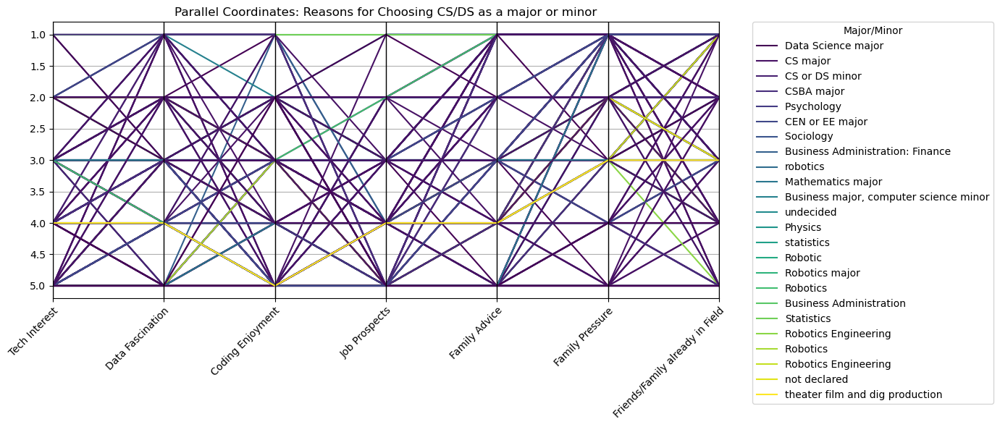

# CS105 Mini-Project
**Group Members: Henry Yost, Riya Ashok, Gokul Giridharan, Refugio Zepeda, Angelina Jordan**

## **1. What data do you have?**
The data collected comes from a survey asking students in CS061, CS010 series, CS105, CS111, and CS170 classes regarding a multitude of questions. The first step(s), explored further below in this section, detail how we took the master dataset with tons of data and split it down into a smaller, more specialized dataset for our question regarding the motivation of students.

The dataset includes:
* Categorical data includes class standing (Freshman, Sophomore, ...).
* Discrete numerical data, involving ratings on a scale of 1-5, 1 being strongly disagree and 5 being strongly agree (Clarity of major, enjoyment, etc).

To address our specific question (shown in section 2), we first cleaned the dataset, removing all incomplete or irrelevant data. Then, we created a specific dataset and a .csv file that includes only the necessary columns for our analysis. Thus, effectively we took a master dataset with tons of information, and boiled it down to only the data that we need regarding our research question.

## **2. What would you like to know?**
What we want to know is how taking coding classes in high school affects the motivation of those majoring in computer science/data science compared to those majoring in computer science/data science who did not take coding classes in high school?

## **3. Explore, present, and analyze your Data**


```python
import pandas as pd
import seaborn as sns
import matplotlib.pyplot as plt

df = pd.read_csv("CS105 Spring'25 Mini-Project Survey (Responses).csv")

# drop all unnecessary columns
columns_to_drop = [1]
columns_to_drop.extend(range(14, 20))
columns_to_drop.extend(range(50, 107))
columns_to_drop.extend(range(112, 175))
columns_to_drop.extend(range(40, 50))
columns_to_drop.extend([34, 35])

df = df.drop(df.columns[columns_to_drop], axis=1)
```

#### Cleaning Data


```python
# rename timestamp column
df = df.rename(columns={'Column 1' : 'Timestamp'})

# drop non-CS/DS majors because it is irrelevant to our question
cols_to_check = df.columns[4:11]
df = df[~df[cols_to_check].isin(["N/A, I am neither a CS or DS major/minor"]).any(axis=1)]


# simplify column data
cols_to_process = df.columns[4:11]
df[cols_to_process] = df[cols_to_process].replace(r'^(\d+).*', r'\1', regex=True).astype(int)

cols_to_process = df.columns[31:36]
df[cols_to_process] = df[cols_to_process].replace(r'^(\d+).*', r'\1', regex=True).astype(int)

response_map = {"Strongly Disagree": 1, "Slightly Disagree": 2, "Not Applicable": 3, "Slightly Agree": 4, "Strongly Agree": 5}
cols_to_process = df.columns[27:31]
df[cols_to_process] = df[cols_to_process].replace(response_map).infer_objects(copy=False)

df.to_csv('cleaned_data.csv', index=False)
```

### 1.1 Matrix Question Correlation Heatmap
    


**Analysis:**
Based on the heatmap, we can conclude that most of the relationships from the matrix questions show either a weak or negative correlation. However, several interesting patterns and insights can still be drawn. 

The strongest positive correlations exist between receiving encouragement or pressure from family members and having family members who work in computer science or data science fields. This is a logical connection because when an individual has family in the field, they're significantly more likely to receive pressure to pursue a similar path. Interestingly, this kind of influence can be a significant cause in initial motivation and also commitment to the major throughout college. 

An extremely relevant pattern is a moderate positive correlation between students who often feel discouraged when coding and those who have considered switching to a major outside of CS/DS. This is interesting because it suggests that there exists only a slight correlation between discouragement and motivation to continue a CS/DS major. This could be due to family pressure, personal pressure, etc, as was briefly touched upon in the paragraph above. What makes it interesting is generally a feeling of persistent discouragement, stemming from a lack of preparedness, can lead students to explore alternative majors. Alternatively, students with prior experience in programming may enter college with significantly greater confidence and motivation.

Interestingly, there is also a strong negative correlation between "I often feel discouraged when coding" and "Comfortable with programming". This suggests that comfort with programming is inversely related to feelings of discouragement. Students who are more confident and comfortable with coding are less likely to feel discouraged, while those who are less comfortable are more likely to feel discouraged.

Lastly, and most relevant to our research question, Motivation to expand beyond the curriculum has a positive correlation with Interest in technology and Enjoyment of coding. This is a logical conclusion, similar to the Motivation to expand beyond the curriculum has a positive correlation with clear reasoning and satisfaction with CS/DS courses at UCR.

#### 1.2 Prior HS Coding Experience in Relation to Motivation and Clarity Heatmap


**Analysis:**
The following heatmap ("Prior HS Coding Experience in Relation to Motivation and Clarity") can provide insight into how previous high school coding experience influences motivation among CS/DS majors. It maps the average responses (on a scale of 1-5, with 1 being "strongly disagree" and 5 being "strongly agree") for two areas. The first column is motivation to explore programming beyond the core curriculum ("Motivation"), and clarity in choosing CS/DS as a major ("Reason Clarity"). Additionally, each row represents a different combination of possible high school CS experiences. There exists a general trend where students with any existing high school coding experience tend to report higher motivation and clarity compared to the "None of the above" category; however, only marginally. This trend suggests that the exposure in high school, or lack thereof of might have little impact on students' motivation for programming.

Additionally, the highest scores include only the MESA program and the MESA and AP programs, showing a maximum motivation score of 4.8. Moreover, the AP and IB correlation stands out because of a high clarity (4.8) and a lower motivation (4), which could suggest an external influence (parenting, which was explored in the previous heatmap) or extrinsic motivators rather than a genuine interest.

Students in the PLTW courses and AP courses tend to score higher on both metrics (motivation of 4.5 and clarity of 4.3), which suggests that the broader and diverse exposure to computer science may contribute to an increase in interest and motivation to pursue a CS/DS degree.

Interestingly, it is important to address the elephant in the room. The motivation of 3.5 and the clarity of 3 for IB courses. This is an extremely rigorous and generally highly regarded curriculum, and it seems out of place to have such low values. This could suggest a smaller pool of participants who were part of the IB program, thus negatively impacting the mean. Additionally, it could suggest that the IB curriculum is better suited for Liberal Arts, Sciences, and Maths, however, more research would need to be done to confirm this.

In general, previous programming experience in high school marginally impacted motivation; however, it had a significantly larger influence on their clarity for picking CS/DS as their major.

### 2.1 Histograms of Distribution of Matrix Questions
    


**Analysis**

* Interest in technology and problem-solving
    * Skewed heavily toward 5 (Strongly Agree), this suggests a general high interest regardless of previous background.
* Fascination with Data Analysis
    * Most respondents selected 4 and 5, showing moderate to strong interest (Normal distribution as well).
* Enjoyment of coding
    * Larger clustering at around 4 and 5, thus coding is overall enjoyable for most respondents.
* Strong Job Prospects
    * Heavily left-skewed, suggesting that there is a strong motivation for job security and the potential of high earnings.
* Encouragement from family/mentors
    * Relatively spread out, therefore nothing of too much interest. Would have to dig a little deeper.
* Pressure from Family
    * Right Skewed, thus suggesting little to very little external pressure. Makes sense, especially given that the "Clear reasoning for choosing CS/DS" is right-skewed, meaning most decisions were most likely personal choice.
* Friends or family working in the field
    * Generally right-skewed, however, also mixed.
* Motivation to expand beyond the curriculum
    * heavily left-skewed, suggesting the majority of students enjoy and have a genuine interest in CS/DS
* Satisfied with CS/DS courses
    * Left-skewed, thus suggesting a high satisfaction with the CS/DS courses taken so far at UCR.
* Clear reasoning for choosing CS/DS
    * Very skewed toward 5, suggesting most students are confident in their choice.
* Considered pursuing a different degree
    * Spread across 2 to 4, but fewer at extremes. Interestingly, those with less early exposure might question their major more often, as we saw a little bit in the heatmap above.
* The code I produce is exceptional
    * Normally distributed, suggesting a neutral self-assessment, which is interesting because I would expect most students to overreport their quality of code in a biased fashion.
* Comfortable with programming
    * Slightly left-skewed and normally distributed, suggesting most feel capable.
* Enjoy coding in an academic setting
    * Bimodal with peaks at 3 and 5, suggesting a mixed opinion.
* Enjoy coding outside an academic setting
    * Mostly left-skewed, suggesting many students enjoy coding outside of school, rather than the HW, Coding assignments, projects, etc, in classes.
* I often feel discouraged when coding
    * Peaked at 4, suggesting many feel discouragement when coding, potentially because of the difficulty or lack of prior success/familiarity.

### 3.1 Individual Bar Graph Representation
#### 3.2 The table below represents the count of each major by college year

<div>
<style scoped>
    .dataframe tbody tr th:only-of-type {
        vertical-align: middle;
    }

    .dataframe tbody tr th {
        vertical-align: top;
    }

    .dataframe thead th {
        text-align: right;
    }
</style>
<table border="1" class="dataframe">
  <thead>
    <tr style="text-align: right;">
      <th>What is your major/minor? (If your major is not listed, please write it in "Other..")</th>
      <th>Business Administration</th>
      <th>Business Administration: Finance</th>
      <th>Business major, computer science minor</th>
      <th>CEN or EE major</th>
      <th>CS major</th>
      <th>CS or DS minor</th>
      <th>CSBA major</th>
      <th>Data Science major</th>
      <th>Mathematics major</th>
      <th>Physics</th>
      <th>...</th>
      <th>Robotics Engineering</th>
      <th>Robotics Engineering</th>
      <th>Robotics major</th>
      <th>Sociology</th>
      <th>Statistics</th>
      <th>not declared</th>
      <th>robotics</th>
      <th>statistics</th>
      <th>theater film and dig production</th>
      <th>undecided</th>
    </tr>
    <tr>
      <th>What is your current class standing?</th>
      <th></th>
      <th></th>
      <th></th>
      <th></th>
      <th></th>
      <th></th>
      <th></th>
      <th></th>
      <th></th>
      <th></th>
      <th></th>
      <th></th>
      <th></th>
      <th></th>
      <th></th>
      <th></th>
      <th></th>
      <th></th>
      <th></th>
      <th></th>
      <th></th>
    </tr>
  </thead>
  <tbody>
    <tr>
      <th>Freshman</th>
      <td>0</td>
      <td>0</td>
      <td>1</td>
      <td>10</td>
      <td>40</td>
      <td>0</td>
      <td>7</td>
      <td>7</td>
      <td>0</td>
      <td>0</td>
      <td>...</td>
      <td>1</td>
      <td>1</td>
      <td>1</td>
      <td>0</td>
      <td>0</td>
      <td>0</td>
      <td>1</td>
      <td>1</td>
      <td>0</td>
      <td>1</td>
    </tr>
    <tr>
      <th>Graduate</th>
      <td>0</td>
      <td>0</td>
      <td>0</td>
      <td>0</td>
      <td>1</td>
      <td>0</td>
      <td>0</td>
      <td>1</td>
      <td>1</td>
      <td>0</td>
      <td>...</td>
      <td>0</td>
      <td>0</td>
      <td>0</td>
      <td>0</td>
      <td>0</td>
      <td>0</td>
      <td>0</td>
      <td>0</td>
      <td>0</td>
      <td>0</td>
    </tr>
    <tr>
      <th>Junior</th>
      <td>0</td>
      <td>0</td>
      <td>0</td>
      <td>3</td>
      <td>19</td>
      <td>5</td>
      <td>2</td>
      <td>6</td>
      <td>1</td>
      <td>1</td>
      <td>...</td>
      <td>0</td>
      <td>0</td>
      <td>0</td>
      <td>1</td>
      <td>1</td>
      <td>0</td>
      <td>0</td>
      <td>0</td>
      <td>0</td>
      <td>0</td>
    </tr>
    <tr>
      <th>Senior</th>
      <td>0</td>
      <td>1</td>
      <td>0</td>
      <td>1</td>
      <td>11</td>
      <td>6</td>
      <td>1</td>
      <td>1</td>
      <td>1</td>
      <td>0</td>
      <td>...</td>
      <td>0</td>
      <td>0</td>
      <td>0</td>
      <td>0</td>
      <td>0</td>
      <td>0</td>
      <td>0</td>
      <td>0</td>
      <td>0</td>
      <td>0</td>
    </tr>
    <tr>
      <th>Sophomore</th>
      <td>1</td>
      <td>0</td>
      <td>0</td>
      <td>3</td>
      <td>19</td>
      <td>3</td>
      <td>3</td>
      <td>17</td>
      <td>1</td>
      <td>0</td>
      <td>...</td>
      <td>1</td>
      <td>0</td>
      <td>0</td>
      <td>0</td>
      <td>0</td>
      <td>1</td>
      <td>0</td>
      <td>0</td>
      <td>1</td>
      <td>0</td>
    </tr>
  </tbody>
</table>
<p>5 rows × 24 columns</p>
</div>

#### 3.4 Graph of Number of Majors within each College Level


**Analysis**

* All grade levels have CS majors
* Freshmen have the greatest number of CS majors
* Most of the grade levels, other than graduate levels, have a diverse range of majors

#### 3.5 The Proportion of College Year and Major out of Total Students

<div>
<style scoped>
    .dataframe tbody tr th:only-of-type {
        vertical-align: middle;
    }

    .dataframe tbody tr th {
        vertical-align: top;
    }

    .dataframe thead th {
        text-align: right;
    }
</style>
<table border="1" class="dataframe">
  <thead>
    <tr style="text-align: right;">
      <th>What is your major/minor? (If your major is not listed, please write it in "Other..")</th>
      <th>Business Administration</th>
      <th>Business Administration: Finance</th>
      <th>Business major, computer science minor</th>
      <th>CEN or EE major</th>
      <th>CS major</th>
      <th>CS or DS minor</th>
      <th>CSBA major</th>
      <th>Data Science major</th>
      <th>Mathematics major</th>
      <th>Physics</th>
      <th>...</th>
      <th>Robotics Engineering</th>
      <th>Robotics Engineering</th>
      <th>Robotics major</th>
      <th>Sociology</th>
      <th>Statistics</th>
      <th>not declared</th>
      <th>robotics</th>
      <th>statistics</th>
      <th>theater film and dig production</th>
      <th>undecided</th>
    </tr>
    <tr>
      <th>What is your current class standing?</th>
      <th></th>
      <th></th>
      <th></th>
      <th></th>
      <th></th>
      <th></th>
      <th></th>
      <th></th>
      <th></th>
      <th></th>
      <th></th>
      <th></th>
      <th></th>
      <th></th>
      <th></th>
      <th></th>
      <th></th>
      <th></th>
      <th></th>
      <th></th>
      <th></th>
    </tr>
  </thead>
  <tbody>
    <tr>
      <th>Freshman</th>
      <td>0.000000</td>
      <td>0.000000</td>
      <td>0.005155</td>
      <td>0.051546</td>
      <td>0.206186</td>
      <td>0.000000</td>
      <td>0.036082</td>
      <td>0.036082</td>
      <td>0.000000</td>
      <td>0.000000</td>
      <td>...</td>
      <td>0.005155</td>
      <td>0.005155</td>
      <td>0.005155</td>
      <td>0.000000</td>
      <td>0.000000</td>
      <td>0.000000</td>
      <td>0.005155</td>
      <td>0.005155</td>
      <td>0.000000</td>
      <td>0.005155</td>
    </tr>
    <tr>
      <th>Graduate</th>
      <td>0.000000</td>
      <td>0.000000</td>
      <td>0.000000</td>
      <td>0.000000</td>
      <td>0.005155</td>
      <td>0.000000</td>
      <td>0.000000</td>
      <td>0.005155</td>
      <td>0.005155</td>
      <td>0.000000</td>
      <td>...</td>
      <td>0.000000</td>
      <td>0.000000</td>
      <td>0.000000</td>
      <td>0.000000</td>
      <td>0.000000</td>
      <td>0.000000</td>
      <td>0.000000</td>
      <td>0.000000</td>
      <td>0.000000</td>
      <td>0.000000</td>
    </tr>
    <tr>
      <th>Junior</th>
      <td>0.000000</td>
      <td>0.000000</td>
      <td>0.000000</td>
      <td>0.015464</td>
      <td>0.097938</td>
      <td>0.025773</td>
      <td>0.010309</td>
      <td>0.030928</td>
      <td>0.005155</td>
      <td>0.005155</td>
      <td>...</td>
      <td>0.000000</td>
      <td>0.000000</td>
      <td>0.000000</td>
      <td>0.005155</td>
      <td>0.005155</td>
      <td>0.000000</td>
      <td>0.000000</td>
      <td>0.000000</td>
      <td>0.000000</td>
      <td>0.000000</td>
    </tr>
    <tr>
      <th>Senior</th>
      <td>0.000000</td>
      <td>0.005155</td>
      <td>0.000000</td>
      <td>0.005155</td>
      <td>0.056701</td>
      <td>0.030928</td>
      <td>0.005155</td>
      <td>0.005155</td>
      <td>0.005155</td>
      <td>0.000000</td>
      <td>...</td>
      <td>0.000000</td>
      <td>0.000000</td>
      <td>0.000000</td>
      <td>0.000000</td>
      <td>0.000000</td>
      <td>0.000000</td>
      <td>0.000000</td>
      <td>0.000000</td>
      <td>0.000000</td>
      <td>0.000000</td>
    </tr>
    <tr>
      <th>Sophomore</th>
      <td>0.005155</td>
      <td>0.000000</td>
      <td>0.000000</td>
      <td>0.015464</td>
      <td>0.097938</td>
      <td>0.015464</td>
      <td>0.015464</td>
      <td>0.087629</td>
      <td>0.005155</td>
      <td>0.000000</td>
      <td>...</td>
      <td>0.005155</td>
      <td>0.000000</td>
      <td>0.000000</td>
      <td>0.000000</td>
      <td>0.000000</td>
      <td>0.005155</td>
      <td>0.000000</td>
      <td>0.000000</td>
      <td>0.005155</td>
      <td>0.000000</td>
    </tr>
  </tbody>
</table>
<p>5 rows × 24 columns</p>
</div>

#### 3.6 Graph of the Proportion of College Year and Major out of Total Students
    


**Analysis**
* Most of the CS majors are freshmen (by a significant proportion)
* Sophomores and juniors have roughly the same number of CS majors
> **Curiosity:** Are students who are CS or DS minors accounted for in terms of what their actual major is?

#### **Overall Bar Graph Analysis:**
Based on the graph (both graphs), you can notice that these values have been normalized. It actually shows that at all college levels, there are various types of majors interested in data science. This may allow us to acknowledge that some students could be interested in data science but not necessarily choose that as their specific major. They would rather choose a specific industry in which they want to apply the concepts. 

Essentially, instead of a more data science broad approach, students may want to have a more specialized path and then use the methods of data science to their advantage. Due to the fact that this data is collected for a data science/CS course, where there are various majors. 

In terms of motivation, it shows that various students to some degree are interested in aspects of data science due to being in the course but it may vary based on specific needs or application uses. Thus, grade level clearly does not have an impact the variety of majors pursuing to learn data science concepts.

### 4.1 Ranking domains of Interest - Stacked Bar Graph
#### 4.2 Students who did not take CS/DS courses in HS

<div>
<style scoped>
    .dataframe tbody tr th:only-of-type {
        vertical-align: middle;
    }

    .dataframe tbody tr th {
        vertical-align: top;
    }

    .dataframe thead th {
        text-align: right;
    }
</style>
<table border="1" class="dataframe">
  <thead>
    <tr style="text-align: right;">
      <th>Rank your top 3 preferred domains of interest in computer science? For options not chosen, select "Not applicable." [Software Engineering]</th>
      <th>1st</th>
      <th>2nd</th>
      <th>3rd</th>
      <th>Not applicable</th>
    </tr>
  </thead>
  <tbody>
    <tr>
      <th>Software Engineering</th>
      <td>0.228571</td>
      <td>0.171429</td>
      <td>0.157143</td>
      <td>0.442857</td>
    </tr>
    <tr>
      <th>Web Development</th>
      <td>0.128571</td>
      <td>0.200000</td>
      <td>0.157143</td>
      <td>0.514286</td>
    </tr>
    <tr>
      <th>Data Science</th>
      <td>0.217391</td>
      <td>0.101449</td>
      <td>0.130435</td>
      <td>0.550725</td>
    </tr>
    <tr>
      <th>Computer Security and Cryptography</th>
      <td>0.100000</td>
      <td>0.142857</td>
      <td>0.128571</td>
      <td>0.628571</td>
    </tr>
    <tr>
      <th>Databases</th>
      <td>0.072464</td>
      <td>0.115942</td>
      <td>0.072464</td>
      <td>0.739130</td>
    </tr>
    <tr>
      <th>Algorithms</th>
      <td>0.114286</td>
      <td>0.100000</td>
      <td>0.157143</td>
      <td>0.628571</td>
    </tr>
    <tr>
      <th>Game Development</th>
      <td>0.268657</td>
      <td>0.238806</td>
      <td>0.119403</td>
      <td>0.373134</td>
    </tr>
    <tr>
      <th>Networks</th>
      <td>0.057971</td>
      <td>0.101449</td>
      <td>0.115942</td>
      <td>0.724638</td>
    </tr>
    <tr>
      <th>Machine Learning, Data Mining, NLP, AI</th>
      <td>0.185714</td>
      <td>0.257143</td>
      <td>0.114286</td>
      <td>0.442857</td>
    </tr>
    <tr>
      <th>Computer Architecture</th>
      <td>0.042857</td>
      <td>0.057143</td>
      <td>0.114286</td>
      <td>0.785714</td>
    </tr>
    <tr>
      <th>Embedded Systems</th>
      <td>0.043478</td>
      <td>0.057971</td>
      <td>0.115942</td>
      <td>0.782609</td>
    </tr>
    <tr>
      <th>Computer Graphics</th>
      <td>0.042857</td>
      <td>0.200000</td>
      <td>0.114286</td>
      <td>0.642857</td>
    </tr>
  </tbody>
</table>
</div>

#### 4.3 Stacked Bar Graph of Domains of Interest for Students that did not take CS course or Program in HS


**Analysis:**

For students that did not take CS courses in High School:
* The field that students had the greatest proportion of students ranking it as their 1st choice: game development (26.87%)
* The field that students had the greatest proportion of students ranking it as their 2nd choice: Machine Learning, Data Mining, NLP, AI (25.71%)
* The field that students had the greatest proportion of students ranking it as their 3rd choice: software engineering, web development, and algorithms - tied (15.71%)
* The field that students had the greatest proportion of students ranking as field not in their top three choices: Computer Architecture (78.57%)

#### 4.4 Students that took any type of CS course or program in High School

<div>
<style scoped>
    .dataframe tbody tr th:only-of-type {
        vertical-align: middle;
    }

    .dataframe tbody tr th {
        vertical-align: top;
    }

    .dataframe thead th {
        text-align: right;
    }
</style>
<table border="1" class="dataframe">
  <thead>
    <tr style="text-align: right;">
      <th>Rank your top 3 preferred domains of interest in computer science? For options not chosen, select "Not applicable." [Software Engineering]</th>
      <th>1st</th>
      <th>2nd</th>
      <th>3rd</th>
      <th>Not applicable</th>
    </tr>
  </thead>
  <tbody>
    <tr>
      <th>Software Engineering</th>
      <td>0.276423</td>
      <td>0.219512</td>
      <td>0.195122</td>
      <td>0.308943</td>
    </tr>
    <tr>
      <th>Web Development</th>
      <td>0.080645</td>
      <td>0.137097</td>
      <td>0.120968</td>
      <td>0.661290</td>
    </tr>
    <tr>
      <th>Data Science</th>
      <td>0.217742</td>
      <td>0.153226</td>
      <td>0.088710</td>
      <td>0.540323</td>
    </tr>
    <tr>
      <th>Computer Security and Cryptography</th>
      <td>0.113821</td>
      <td>0.105691</td>
      <td>0.154472</td>
      <td>0.626016</td>
    </tr>
    <tr>
      <th>Databases</th>
      <td>0.032787</td>
      <td>0.106557</td>
      <td>0.081967</td>
      <td>0.778689</td>
    </tr>
    <tr>
      <th>Algorithms</th>
      <td>0.048387</td>
      <td>0.129032</td>
      <td>0.088710</td>
      <td>0.733871</td>
    </tr>
    <tr>
      <th>Game Development</th>
      <td>0.153226</td>
      <td>0.177419</td>
      <td>0.153226</td>
      <td>0.516129</td>
    </tr>
    <tr>
      <th>Networks</th>
      <td>0.016260</td>
      <td>0.081301</td>
      <td>0.097561</td>
      <td>0.804878</td>
    </tr>
    <tr>
      <th>Machine Learning, Data Mining, NLP, AI</th>
      <td>0.213115</td>
      <td>0.237705</td>
      <td>0.147541</td>
      <td>0.401639</td>
    </tr>
    <tr>
      <th>Computer Architecture</th>
      <td>0.024194</td>
      <td>0.088710</td>
      <td>0.088710</td>
      <td>0.798387</td>
    </tr>
    <tr>
      <th>Embedded Systems</th>
      <td>0.064516</td>
      <td>0.040323</td>
      <td>0.088710</td>
      <td>0.806452</td>
    </tr>
    <tr>
      <th>Computer Graphics</th>
      <td>0.048780</td>
      <td>0.089431</td>
      <td>0.105691</td>
      <td>0.756098</td>
    </tr>
  </tbody>
</table>
</div>


#### 4.5 Stacked Bar Graph of Domains of Interest for Students that took any type of CS course or Program in HS


**Analysis**

For students who did take any type of CS course in High School:
* The field that students had the greatest proportion of students ranking it as their 1st choice: software engineering (27.64%)
* The field that students had the greatest proportion of students ranking it as their 2nd choice: Machine Learning, Data Mining, NLP, AI (23.77%)
* The field that students had the greatest proportion of students ranking it as their 3rd choice: software engineering (19.51%)
* The field that students had the greatest proportion of students ranking as field not in their top three choices: Embedded Systems (18.64%)

#### **Overall Analysis of both Stacked Bar Graphs:**

Comparing the top three domains of interest between students that did not take CS courses in high school and those that did take CS courses in high school, the results seem to indicate that those who did not take CS courses in high school have ranked domains of interest that are broad and interdisciplinary such as game development as their top choice while those who took CS courses in high school choose a highly popular and well-paid field such as software engineering as their top choice.

Both students who did and did not take CS courses ranked Machine Learning, Data Mining, NLP, AI as their second choice, indicating that prior experience with CS in high school did not affect students' level of interest in this field. Since this survey was mainly taken by students in CS/DS classes, it is reasonable that an up-and-coming and popular field like Machine Learning would equally appeal to all CS/DS students.

Based on the third choices, students who did not take CS courses in high school appeared to have more varied interests in fields like web development and algorithms, along with software engineering, which also ended up as the third choice for students who took CS courses in high school.

Additionally, both students who did and did not take CS courses in high school did not have a preference for hardware-focused fields such as Computer Architecture and Embedded Systems.

### 5.1 Box Plot


**Analysis:**
The box plot above compares taking a coding class in high school and overall motivation to expand CS/DS knowledge. We can see that students who took high school courses show a slightly higher median motivation score than those who did not. We can also see that the spreads between the two are about the same, with just some lower outliers for the students who did not take a coding class in high school. We can see that very few students who took coding classes in high school marked their motivation as low. Overall, we can see that there is a slight difference between the two, giving students who have taken coding classes in high school slightly more motivation to expand their knowledge. But in the broad sense, the students want to expand their CS/DS knowledge regardless of whether or not they took a high school coding course or not.

### 6.1 Parallel Coordinate Graph



**Analysis:**
The question is when looking for an answer to the motivation the student had towards a ranking system, which ranked a student's reasons for choosing to be a CS or DS minor or major

* One of the most notable things from the graph is the high concentration of Job Prospects has as the number one reason for choosing a major or minor in CS/DS
    * To further support this notion, job prospects have a low concentration for the 1, 2, and 3 rankings
* Another notable factor in this is the high concentration Family Pressure has as the lowest ranked reason for choosing to be a CS/DS as a major or minor
    * To go along with this, it's noticeable how family pressure has low concentrations for the other rankings.

Overall we can conclude that Job Prospects is the most important motivating factor for going into this field and family pressure is the least motivating factor for going into this field both of which are a job sign as it will make the market more competive/productive but also looking at the fact that students might be starting to sway themselves away from not wanting to do what they want career wise.

## **4. Hypothesis**
$H_1$: There exists a correlation between students who are later in their academic journey and a clearer understanding of why they chose CS/DS as their major.

* ANOVA Test

```python
df['high_reason'] = df["Answer the following questions regarding CS/DS [I have a clear reason for choosing CS/DS as my major.]"]

data = df.groupby("What is your current class standing?")['high_reason'].mean().to_frame(name='Reason Clarity')

plt.figure(figsize=(6, 6))
sns.heatmap(data, annot=True, cmap="Blues")
plt.title("Academic Year in Relation to Clarity for Picking CS/DS as Major")
plt.xticks(rotation=90, ha='right')
plt.ylabel("Academic Year")
plt.show()
```
 


**Heatmap Analysis:** There's a slight upward trend for students later in their academic careers, especially with the graduate group standing out the most. However, the difference between underclassmen and upperclassmen is not strong across the board. Juniors and seniors don’t show much more clarity than freshmen. Therefore, we can not confidently reject $H_o$ without performing a statistical test, which we will do below.

$H_2$: There is a correlation between whether a CS/DS student wants to change their major or not and whether a CS/DS student took a CS course in high school or not.

* Chi-squared test


```python
import pandas as pd
import matplotlib.pyplot as plt


# The example is taken from the cs105 class. We want to check if the ?? and ?? is independent or not.
df = pd.read_csv("cleaned_data.csv")

# Create df for students who did not take any CS/DS course
none_df = df[df['Which of the following computer science programs or courses did you take during high school? Select all that apply.'] == 'None of the above']

# Filter to include students who took any CS/DS course
any_df = df[~df.index.isin(none_df.index)]

# Create df for students who have not thought about changing major
noswitch_df = df[df['Have you ever thought about changing your major? If so, what were the reasons? Choose all that apply.'] == 'N/A, I have never thought about changing my major.']

# Filter to include students who have thought about changing major
switch_df = df[~df.index.isin(noswitch_df.index)]

#Create columns
#https://www.geeksforgeeks.org/applying-lambda-functions-to-pandas-dataframe/ (to decrease degrees of freedom)
combinecourse_df = pd.concat([none_df, any_df])
combinecourse_df['Took_HS_Coding'] = combinecourse_df['Which of the following computer science programs or courses did you take during high school? Select all that apply.'].apply(lambda x: 'None of the above' not in str(x))
combineswitch_df = pd.concat([noswitch_df, switch_df])
combineswitch_df['Changing_Major_Reasons'] = combineswitch_df['Have you ever thought about changing your major? If so, what were the reasons? Choose all that apply.'].apply(lambda x: 'N/A, I have never thought about changing my major.' not in str(x))

#create table
contingency_table = pd.crosstab(combinecourse_df['Took_HS_Coding'], combineswitch_df['Changing_Major_Reasons'])

#create proportion table
HS_coding_not = contingency_table.sum(axis = 1)
HScoding_given_majorchange = contingency_table.divide(HS_coding_not, axis = 0)

HScoding_given_majorchange
```

<div>
<style scoped>
    .dataframe tbody tr th:only-of-type {
        vertical-align: middle;
    }

    .dataframe tbody tr th {
        vertical-align: top;
    }

    .dataframe thead th {
        text-align: right;
    }
</style>
<table border="1" class="dataframe">
  <thead>
    <tr style="text-align: right;">
      <th>Changing_Major_Reasons</th>
      <th>False</th>
      <th>True</th>
    </tr>
    <tr>
      <th>Took_HS_Coding</th>
      <th></th>
      <th></th>
    </tr>
  </thead>
  <tbody>
    <tr>
      <th>False</th>
      <td>0.471429</td>
      <td>0.528571</td>
    </tr>
    <tr>
      <th>True</th>
      <td>0.548387</td>
      <td>0.451613</td>
    </tr>
  </tbody>
</table>
</div>

```python
import pandas as pd
import matplotlib.pyplot as plt

#create stacked bar graph
HScoding_given_majorchange.plot(kind='bar', stacked=True, figsize=(10, 6))
plt.title('Those who Want to change major given they whether they took a CS course in high school')
plt.xlabel('Whether a Student Took CS Course in High School or Not')
plt.ylabel('Proportion')
plt.legend(title='Whether a Student Considered Changing Major or Not', loc='upper right')
plt.show()
```


**Stacked Bar Chart:** 
Taking a CS course in high school appears to correlate with a reduced likelihood of considering a major change. However, the difference between the two groups is modest, so while it suggests a trend, it may not be strongly conclusive without statistical testing.

$H_3$: There is a correlation between students' motivation to expand their knowledge outside of the curriculum and the likelihood of having a higher GPA.

* Spearman Rank Correlation Test

```python
import seaborn as sns
import matplotlib.pyplot as plt

df_anova = df.rename(columns={'What is your current cumulative GPA?':'GPA',
                              "Answer the following questions regarding CS/DS [I feel motivated to expand my CS/DS knowledge and skills beyond UCR’s core curriculum.]": 'Motivation'})

sns.boxplot(x='Motivation', y='GPA', data=df_anova)
plt.title('Motivation by GPA Range')
plt.xlabel('Motivation Ranking')
plt.ylabel('GPA Range')
plt.xticks(rotation=45)
plt.tight_layout()
plt.show()
```


**Boxplot Analysis:**
When comparing the different GPA ranges depending on the ranking, it's clear that no matter the GPA of the students, 50 percent of the data is within the 4th or 5th rankings. To determine if there is a correlation, a statistical test will need to be performed.

## **5. Hypothesis Test**
##### ANOVA Test for $H_1$, where:
$H_o$: There exists no correlation between students who are not later in their academic journey and a clearer understanding of why they chose CS/DS as their major.

$H_A$: There exists a correlation between students who are later in their academic journey and a clearer understanding of why they chose CS/DS as their major.

We are using an ANOVA test, which is a statistical test that analyzes the variance between groups. An ANOVA test is appropriate, because we want to test the relationship between Students in their academic journey (categorical) and clarity for picking their major (ordinal, treated as numeric)


```python
# https://www.youtube.com/watch?v=EWYzeZbchR0 (for reference as to how to do ANOVA test in Python)
import statsmodels.api as sm
from statsmodels.formula.api import ols

df_anova = df.rename(columns={'What is your current class standing?': 'year','Answer the following questions regarding CS/DS [I have a clear reason for choosing CS/DS as my major.]': 'clarity'})

model = ols('clarity ~ year', data=df_anova).fit()
res = sm.stats.anova_lm(model, typ=2)
res
```

<div>
<style scoped>
    .dataframe tbody tr th:only-of-type {
        vertical-align: middle;
    }

    .dataframe tbody tr th {
        vertical-align: top;
    }

    .dataframe thead th {
        text-align: right;
    }
</style>
<table border="1" class="dataframe">
  <thead>
    <tr style="text-align: right;">
      <th></th>
      <th>sum_sq</th>
      <th>df</th>
      <th>F</th>
      <th>PR(&gt;F)</th>
    </tr>
  </thead>
  <tbody>
    <tr>
      <th>year</th>
      <td>5.353282</td>
      <td>4.0</td>
      <td>1.01339</td>
      <td>0.401715</td>
    </tr>
    <tr>
      <th>Residual</th>
      <td>249.600327</td>
      <td>189.0</td>
      <td>NaN</td>
      <td>NaN</td>
    </tr>
  </tbody>
</table>
</div>

**Analysis:**
The P-value of 0.401715 is greater than our alpha of 0.05, we do not have sufficient evidence to conclude that students in different years have a significantly different response to the clarity question on the survey. In other words, we do not have sufficient evidence to prove that students later in their academic journey have a clearer understanding of why they chose CS/DS as their major.

##### Chi-Squared Test for $H_2$, where:


$H_o$: There is no correlation between whether a CS/DS student wants to change their major or not and whether a CS/DS student took a CS course in high school or not.

$H_A$: There is a correlation between whether a CS/DS student wants to change their major or not and whether a CS/DS student took a CS course in high school or not.

We are using a Chi-squared test to determine if there is a significant association between the two categorical variables: whether a CS/DS student wants to change their major, and whether a CS/DS student took a CS/DS course in high school.


```python
from scipy.stats import chi2_contingency

# calculate the chi-square value of the dataset
# https://docs.scipy.org/doc/scipy/reference/generated/scipy.stats.chi2_contingency.html
chi, p, dfree, expected = chi2_contingency(contingency_table)
print("calculated chi square value: " ,chi)
print("calculated p value: " ,p)
print("degree of freedom: ", dfree)

# get the threshold to reject the hypothesis by certain significance value and the degree of the freedom.
from scipy.stats import chi2
print("for 1 degree of freedom, the chi-square value needed to reject the hypothesis at the 0.05 significance level:")
chi2.ppf(0.95, 1)
```

    calculated chi square value:  0.7758002208723924
    calculated p value:  0.3784286670026542
    degree of freedom:  1
    for 1 degree of freedom, the chi-square value needed to reject the hypothesis at the 0.05 significance level:


    3.8414588206941205


**Analysis:**
Degrees of freedom = (2 - 1)(2 - 1) = 1. The chi-squared value of 0.7758 is less than the critical value of 3.84 for 1 degree of freedom, so we fail to reject the null hypothesis.

Conclusion: It is 95% likely that there is no correlation between whether a CS/DS student wants to change their major or not and whether a CS/DS student took a CS course in high school or not.

##### Spearman Rank Correlation Test for $H_3$, where:

$H_o$: There is no correlation between students' motivation to expand their knowledge outside of the curriculum and the likelihood of having a higher GPA.

$H_A$:  There is a correlation between students' motivation to expand their knowledge outside of the curriculum and the likelihood of having a higher GPA.

A Spearman Rank Correlation test calculates the coefficient that ranges from -1 (perfect negative correlation) to +1 (perfect positive correlation), with 0 as the no correlation value. This test is appropriate because we are testing the relationship between two ordinal variables: students' motivation to expand their knowledge outside of the curriculum (on a scale of 1-5) and GPA (ordinal, categorized into ranges).


```python
import pandas as pd
from scipy.stats import spearmanr

df = pd.read_csv('cleaned_data.csv')

df_spearman = df.rename(columns={
    'What is your current cumulative GPA?': 'GPA',
    'Answer the following questions regarding CS/DS [I feel motivated to expand my CS/DS knowledge and skills beyond UCR’s core curriculum.]': 'Motivation'
})

df_filtered = df_spearman[['GPA', 'Motivation']].dropna()

rho, p_value = spearmanr(df_filtered['GPA'], df_filtered['Motivation'])

print(f"Spearman correlation coefficient (ρ): {rho}")
print(f"P-value: {p_value}")
```

    Spearman correlation coefficient (ρ): 0.06678820304625267
    P-value: 0.35482345095392587


**Analysis:**
The Spearman Rank Correlation test produced a P-value of 0.3548 and a correlation value (ρ) of 0.06688, which means that, since it is very close to 0, there is a very weak positive correlation between students' motivation to expand their knowledge and their GPA. So, since there is very little to no correlation, we can infer that the two variables don't influence each other.

## **6. Conclusion**

This mini project examines how taking coding classes in high school affects the motivation of students majoring in computer science (CS) or data science (DS). Through different types of visualizations and statistical analysis, we wanted to see and understand the relationship between early exposure to coding and students' motivation and clarity in pursuing CS/DS-related degrees. The correlation heatmaps revealed that the motivation the students have to expand their knowledge beyond the curriculum is positively correlated with the enjoyment of coding and interest in tech. The box plot and heat maps indicated slight differences in motivation level between students who took high school coding classes and ones who did not. The histograms and the bar graphs showed that there tended to be high motivation and satisfaction among all CS/DS students, but discouragement was only common among people who felt less comfortable with programming. The stacked bar graphs showed that students with prior coding knowledge in high school preferred jobs like software engineering, and students who didn't have prior experience tended to lean towards game development. For the first hypothesis, we can see that according to the ANOVA test that since the p-value is greater than 0.4, there is no significant difference in the clarity of major choice based on their standing. For the second hypothesis, we can see that the CHI-SQUARED test produces a p-value of about 0.38, so there is no significant correlation between taking coding and high school and the chance of considering changing majors. The third hypothesis uses the Spearman Rank Correlation test to produce a P-value of 0.355 and a correlation value (ρ) of 0.06688, which suggests little to no significant correlation between GPA and motivation to expand CS/DS knowledge. Back to the main question, we can see that the data suggests that taking high school coding classes has a slight positive impact on motivation and provides a good idea for why those students choose CS/DS as their major. But the effect is not strong enough to be statistically significant. So, regardless of taking a coding class in high school, we can see that most of the students show high motivation, interest in coding, and satisfaction with the major they chose. So even though taking coding classes in high school offers a little confidence, we can see that the other factors discussed, like interest and career prospects, play a much larger role in sustaining motivation in the grand scheme of things.

### Contribution
* Henry: (20%) Organized the Jupyter notebook, did the Heatmaps + analysis, Histograms + analysis, and $H_1$.
* Angelina: (20%) Worked on the bar Charts and analysis.
* Riya: (20%) Worked on the stacked bar charts and analysis. Additionally, worked on $H_2$.
* Refugio: (20%) Did the parallel coordinate map, analysis, and also $H_3$.
* Gokul: (20%) Worked on the boxplot, $H_3$, and additionally wrote the conclusion.
